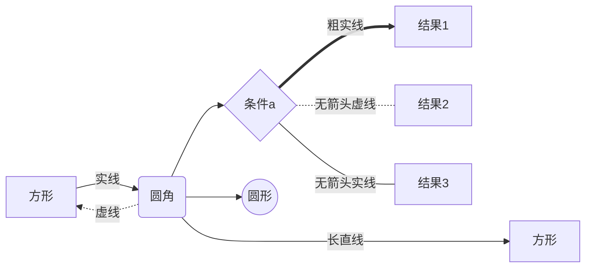

# WebRtc 实现音视频推拉流

## Demo

**参考项目**

- flutter 项目地址``Fltter`` ``Dart`` ``ios`` ``Android`` ``web`` ``JNI`` ``C++`` 
  https://github.com/flutter-webrtc/flutter-webrtc-demo
- server 项目地址``go``  
  https://github.com/flutter-webrtc/flutter-webrtc-server

## 样例1

